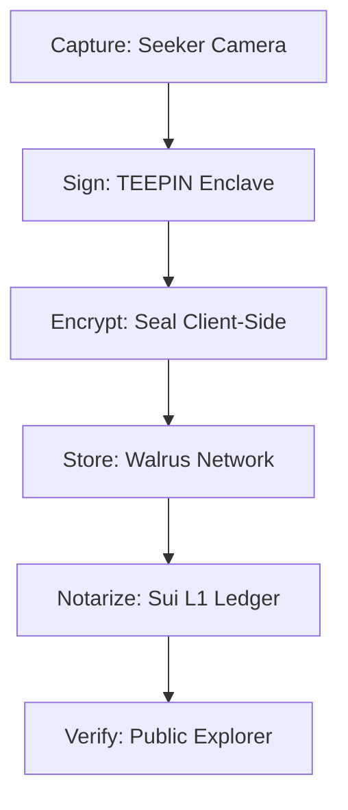

# Indelible Blob: Technical Architecture ⛓️🛡️

This document details the **Sovereign Stack**—a synergistic integration of hardware, cryptography, and decentralized storage that transforms raw media into verified truth.

## 1. The Stack Layers

### Layer 1: Hardware Root of Trust (Solana Seeker & TEEPIN)
*   **Infrastructure**: TEEPIN (Trusted Execution Environment Platform Infrastructure Network).
*   **Function**: Generates a **Proof of Origin** signature inside the processor's secure enclave at the moment of capture.
*   **Integrity**: Prevents GenAI or edited content from being passed off as raw capture.

### Layer 2: Privacy & Identity (Seal & zkLogin)
*   **Infrastructure**: Mysten Seal (DSM) + Sui zkLogin.
*   **Function**: Provides client-side, identity-bound encryption.
*   **Sovereignty**: Users own their keys (via wallet/hardware) and control who can decrypt their "Sovereign" captures.

### Layer 3: Decentralized Storage (Walrus Protocol)
*   **Infrastructure**: Walrus (Red Stuff + Erasure Coding).
*   **Function**: Stores the high-volume media blobs (Photos/Videos) permanently and cheaply across a global network.
*   **Indelibility**: No central point of failure or deletion.

### Layer 4: Immutable Notary (Sui Blockchain)
*   **Infrastructure**: Sui Move Contract.
*   **Function**: Records the content hash, TEEPIN signature, and Walrus Blob ID.
*   **Verification**: Serves as the public ledger for verifying the "Nutrition Label" of any blob.

## 2. The Synergy: "Lens to Ledger"

1.  **Capture**: Pixel data generated on the Seeker.
2.  **Sign**: Immediate hardware attestation of the raw hash.
3.  **Encrypt**: Data is wrapped in a private envelope.
4.  **Store**: Blob is shredded and stored globally.
5.  **Notarize**: The proof is etched onto the Sui blockchain.
6.  **Verify**: Anyone with the Blob ID can verify its pedigree.

---

## 3. Deployment Configuration
*   **Current State**: Multi-protocol Testnet (Sui Testnet, Walrus Testnet, Solana Testnet).
*   **Mainnet Transition**: Designed to be a zero-code configuration switch in the `.env` layer.
